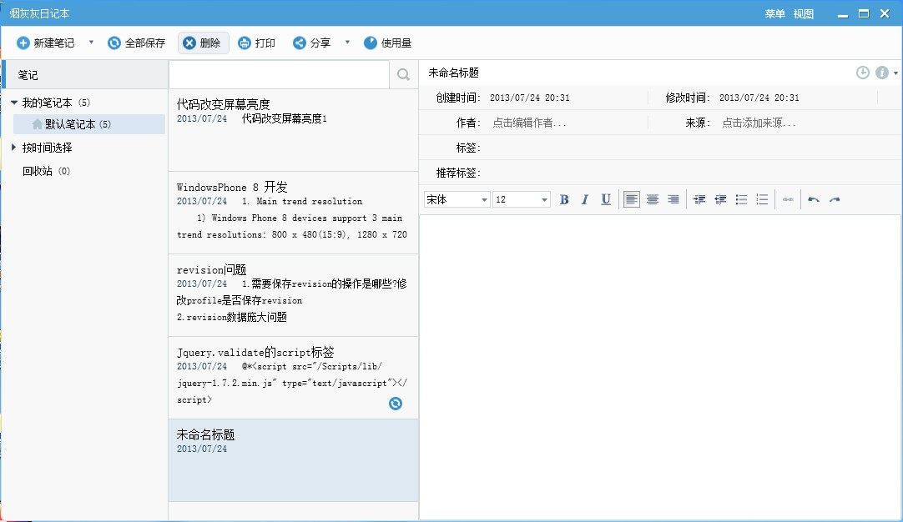

楼主所在的公司不允许下载外部资源, 不允许私自安装应用程序, 平时记录东西都是用记事本,时间久了很难找到以前记的东西. 平时在家都用有道笔记, 因此就模仿着做了一个, 先看下实际运行图片:

1\. 初始化的时候

2.添加了些笔记

3\. 添加笔记本窗口

4.改了模板,做的一个还算好看的菜单

5.日记列表可以选择不同的视图, 比如我改成了简单列表视图

6.模仿云笔记做的历史版本功能,只能看,还没做还原和对比功能

7.日记可以导出成不同格式,这个东西真心没用

8.顶部也有个菜单

谈下这个小东西:

1\. 程序采用WPF+MVVM实现, 修改了大部分控件的Template, 以达到高仿的目的. 同时, 也得感谢有道在安装目录下有一套图片资源,可以原封不动的搬过来美化界面.

2\. 实现了笔记本的增删改, 笔记的增删改. 笔记的查询只实现了关键字查询.

3\. 自己做了一些有意思的控件, 比如一个LoadingButton, 在Loading的时候会转个圈圈, 后台处理完毕后隐藏. 还做了一个文本编辑框, 其实有道的编辑框相当漂亮,但是没有放出按钮图片,我只有网上淘了些山寨的图片, 而且有些功能就没去实现,比如添加表格添加超链接什么的,我自己都不知道这个能干嘛用.

4. 采用SQLite数据库把所有数据保存到了本地, 我自己也有虚拟主机, 本来想顺便公布一套WEB API实现真正的云笔记, 但是现在的客户端设计怕是要经过大改才能实现, 这个想到就头痛.

5\. 历史版本功能本来是可以继续做下去的, 比如还原到某一版本这个功能就很好做. 但是有道有个对比不同文本的功能,这个就像源码管理工具那样,我不知道该怎么整了.

6\. 本来想实现插入图片的, 但是有两个问题, 第一就是我们公司没有截图程序, 我用不上, 第二就是这里的图片只能保存到RTF, 加载时会写入内存, 数据量大或者图片大了会影响性能.

7\. 本来也想实现插入文件的, 这个对我很有用, 不过还没想好UI怎么画, 一直就没做.

8\. 编辑框输入很卡, 还没去研究什么原因. 

9\. 微软的个人版TFS相当不错, 我在不能用U盘的情况下, 家里和办公室都可以开发.

最后, 实在是觉得很遗憾,一个项目我可以兴冲冲的很快完成70%的代码,但是剩下的30%就实在太折磨人了. 现在一打开VS就犯困, 实在是没法把剩下的东西全部实现完. 这个笔记目前在公司运行良好, 我需要的功能几乎都有, 也就不打算再继续下去了. 在此放出源代码, 供有兴趣的同学研究下控件样式, MVVM, Prism, 依赖注入等WPF里面常见的问题.

[源码下载](http://files.cnblogs.com/scheshan/SmokeNote.rar)

下载源码请注意:

1\. 项目是用VS2012搭建, 相关的引用资源在Using文件夹下. 数据库文件是Using/SmokeNote.db, 需要放在运行目录.

2\. 这个程序本来是楼主自己写来自己用的, 连程序图标都直接搬的有道图标, 因此源码只供学习使用.

3\. 以前我发的几个小东西, 后来发现被转到51ASPX等下载站点, 请转载的时候注明出处, 或者写明作者.